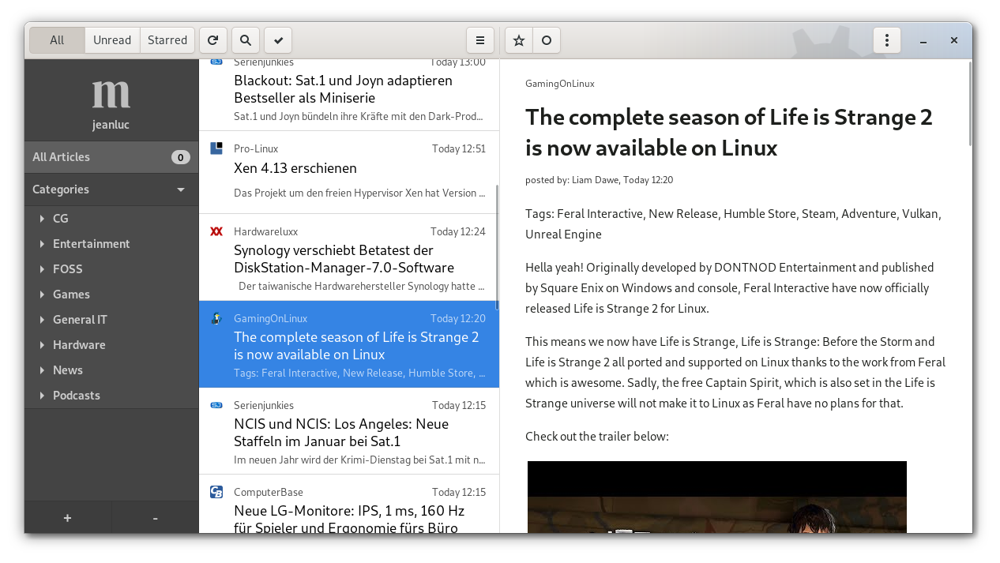

# NewsFlash

The spiritual successor to [FeedReader](https://github.com/jangernert/FeedReader)

## Looking for service maintainers

I'm looking for people that are actively using a specific service backend of NewsFlash and are willing to maintain it.
The size of the code for each service is quite managable. But keeping an eye on and testing every service can be quite challenging.
So this time around I'm hoping to find at least one person per service that knows the basics of rust and uses the service on a (almost) daily basis.

Services & Maintainers:

- Miniflux: JanGernert (me)
- feedly: still looking
- local RSS: still looking